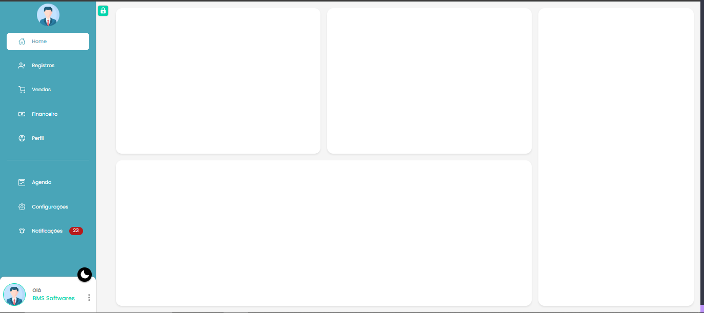
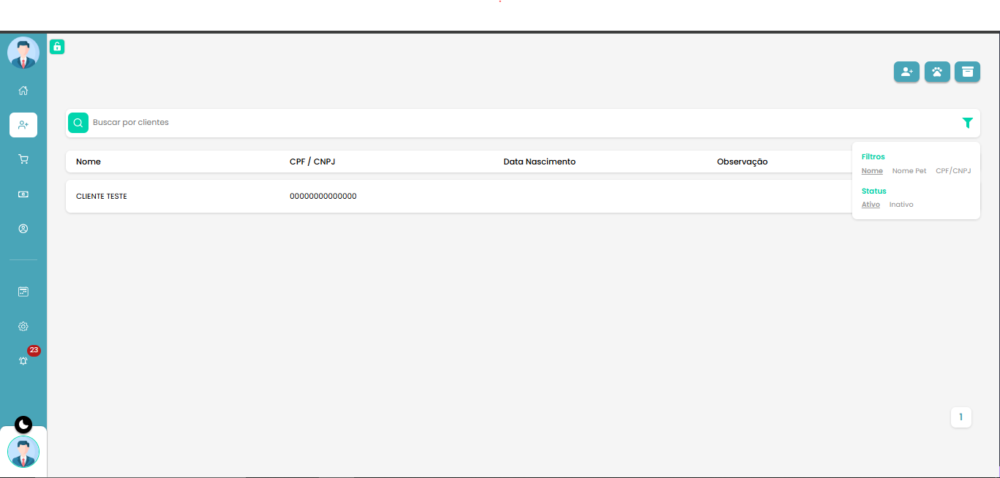
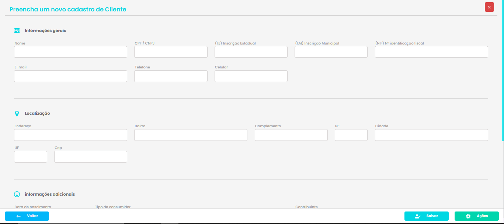
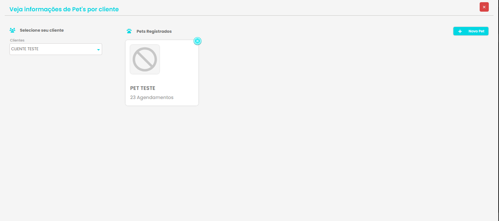
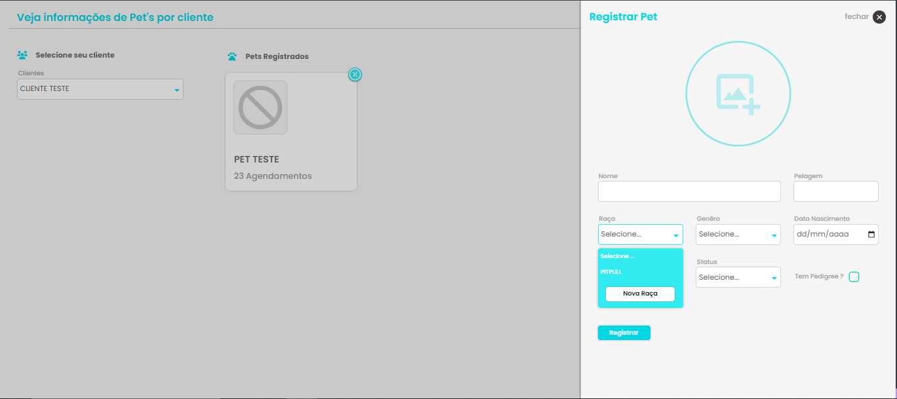
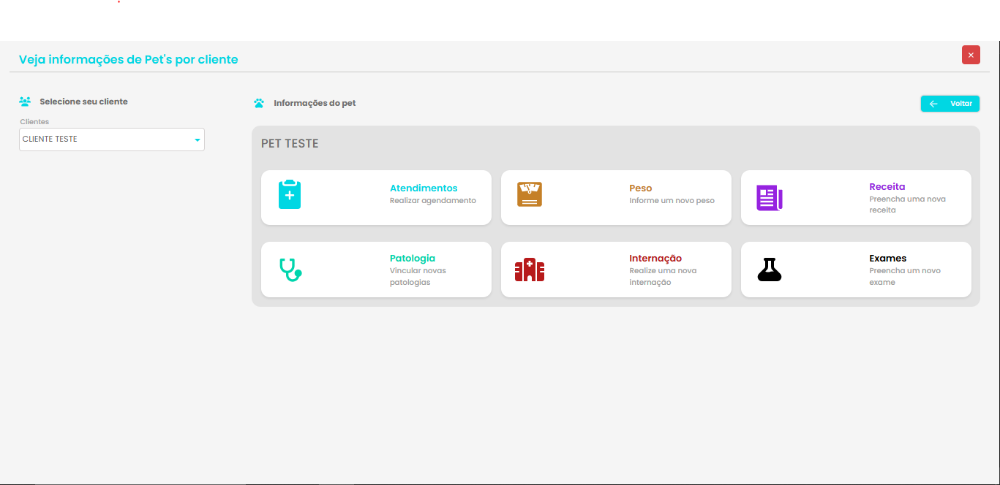
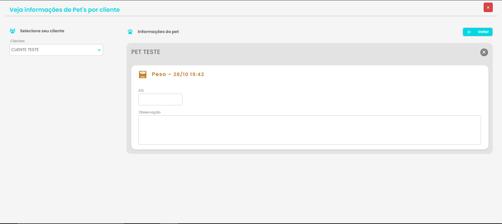

## **Observações**
Backend esta com repositório privado.

## **🛑 STOP 🛑** **`Aplicação parada devido a meu foco em outro projeto, pretendo voltar a mexer em breve`**

### Tecnologias Utilizadas
  React/styled-componets/Redux + React toolkit

### Instalação e Configuração

Realize o clone do projeto usando: **`git clone https://github.com/EriksJunior/app_pet_shop.git`**

Acesse o diretorio do projeto **`cd app_pet_shop`**

Instale as dependências: **`npm install`** obs: certifique-se de ter node instalado

Inicie o projeto: **`npx run dev`**.

## Telas

### Home
**Atualmente contém somente funcionalidades nas telas de registros/agenda**

### Registers
**Tela de registros com listagem de clientes e ações basicas na tabela como editar/excluir o cliente. e podendo cadastrar um novo cliente/pet**

### New Customer
**Formulario de clientes com validações dos inputs utilizando `joi`**

### Customer Pets
**Tela para pets do cliente, tanto para listagem/detalhes de pets registrados quanto para novos pets**

### New Customer Pets
**Formulario para criação/edição de novos pets**

### Pet Details
**Detalhes do pet**

### Pet Details
**Peso do pet**

### O Sistema também conta com temas Dark e Light